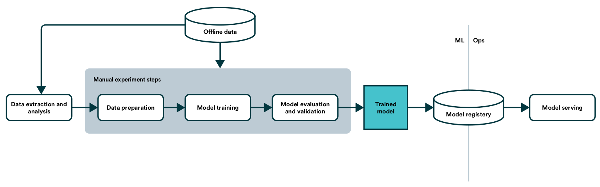
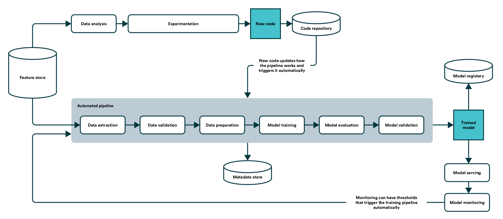

# Practical MLops

## How to get ready for production models

This is the summary of [an ebook by Valohai](https://valohai.com/assets/files/practical-mlops-ebook.pdf)

---

### Why MLOps Matters?

This is where MLOps comes in to combine operational know-how with machine learning and data science knowledge.

---

### People of Machine Learning

- Data Scientist
- Data Engineer
- Machine Learning Engineer
- DevOps Engineer
- IT
- Business Owner
- Manager

---

### How Is Machine Learning Different from Traditional Software?

In machine learning, a  version  of  the  code  and  a  version  of  the  data  together  produce  a  version of the ML model.

---

## The MLOps Workflow

### What Is the Point of MLOps?

Therefore, time to market should be the number one metric to look at and optimize for any ML project.

### Risks MLOps workflow tackles

1. Loss of knowledge
    - We recommend a version control system that can track your whole pipeline from raw data to the model, including your code, environment, configurations, and parameters.
2. Failures in production
    - Ensure that the data used to train a model looks like you expected it to.
    - Ensure that the model works not only in training but in a real-world environment.
    - Ensure that the infrastructure works consistent.
3. Regulatory and ethical
    - While MLOps can’t fix model biases, it comes with the notion that these concerns should be addressed by codifying tests for them into a machine learning pipeline.
4. Data security

### Time to Market

- To get a truly scalable business model around ML usually requires that you step back and think of your product in terms of the pipeline instead of a single instance of a trained model.
- Broadly speaking, there are two ways that MLOps helps accelerate the time to market of machine learning:
    1. It creates a shared language among the extended team.
        - Modern tooling and shared work methods (CI/CD, version control, microservices) have enabled companies to scale their throughput in software development exponentially.
    2. It automates manual tasks.
        - Automation of collecting data, training, and evaluating models allows the most scarce resources, i.e. data scientists, to focus their efforts on further development.
        - However, in the most extreme cases, your model needs to be updated all the time to keep up with the pace at which the underlying data is changing.

### The MLOps Workflow Enforces Best Practices

- Version  control  everything,  including  models,  code,  data, parameters, and environment. Enable anyone to trace how a model was produced.
- Componentize the steps of the model creation process and build them into a pipeline. A single notebook is not a pipeline.
- Codify testing. With checkpoints and safeguards in place, there is a standard that models have to adhere to.
- Automate work to increase how much time can be spent on future development.

---

## How to Quantify Success in an MLOps Project?

Only a model that is running in production can bring value.

Here are three steps to get started:

1. Define your objective and clear, concrete, and measurable metrics with all the relevant stakeholders
    - Ensure everyone understands the “why” behind the project (...)
    - Document and share how the work is currently done (...) and what it will take to replace the current way of working.
    - Uncover assumptions that different team members have (...)
2. Measure the success of different stages of the project (...)
    - It will be hard to estimate the total time it will take to deliver
    - Make sure you split your project into smaller pieces to validate your assumptions, track your progress, and gather feedback.
    - (...) make sure you reflect on your progress and whether you’re heading in
the right direction to solve the original issue. Don’t be afraid to go back to defining the problem. Document the lessons you’ve learned and place them in an internal Wiki for other teams to learn from.
3. Have a multi-disciplinary team with clear roles and responsibilities
    - (...) measure how well your team is working together.
    - Make sure everyone understands each other’s roles and responsibilities in this project.
    - Involve IT early on

### Speak the Same Language

### Use Every Project as an Opportunity to Educate Your Organization about Machine Learning

(...) make sure you share learning from your machine learning
projects across the organization.

### Define Clear Shared Objective and Metrics

- #### Assumptions

  - Why does this project exist?
  - How is performance measured today?
  - How will the deployed model be consumed?
  - Who owns the data?

- #### Success criteria

  - When defining the metrics for your success criteria, think about:
    - What is the key metric that will determine if the model can be taken to production?
    - How will the model be taken to production?
    - How often will the model need to be updated?
    - Model metrics
    - Cost to maintain and update the model
    - Ethical considerations
  - What’s the minimum viable product?
    - Model accuracy x to be able to test in a sandboxed environment
    - Manually train, build and deploy the pipeline.
  - MLOps metrics
    - Model update frequency met (and able to identify stale models)
    - Time to re-train and deploy a new model and push to production
    - Performance of model endpoint for online predictions (e.g. response time in ms)
    - /# of calls / % of failed calls to the model endpoint
    - Collaboration between the multi-disciplinary team (e.g. data scientists, engineers, IT-Ops, legal, business)
    - Attendance of key stakeholders to regular project updates (for example, every six weeks)
    - Infrastructure scales to the machine learning teams without manual work from IT.

---

## Real-World Example - The Story of Two Companies

### Company 1

Company 1 jumps right into the nitty-gritty and starts gathering and analyzing data. (...) From idea to production, the delivery time is blazingly fast. 
It’s hard to reproduce all the steps that it took to train the model – but it gets done. 
Finally, the company decides to put in place tooling to automate retraining and deployment, and at this point, everything is rebuilt.

### Company 2

Company 2 acknowledges that machine learning models will be core assets going forward and decides to adopt ML focused tooling before going past the first successful proof-of-concept. 
While Company 2 is slower to initial delivery, the benefits start to compound quickly. Everything is automatically reproducible, and data scientists can concentrate on further development rather than firefighting.

### Learnings

- The right time to consider tooling and workflow is when the first data scientist is hired, not when the first model goes to production (...)
- Building up an ML workflow does require a strategic commitment and investment from the company.

---

## The MLOps Toolchain

### Model and Data Exploration

Exploration is the first concrete, hands-on step of any machine learning project.

#### Data Exploration

Without data, there can be no model, so data exploration precedes model exploration quite naturally. 
Fast iterations and visual feedback are the critical components for the data exploration work. 
Many of the notebooks for this step end up as disposable throwaways. 
Reproducibility, library dependencies, and version control can bring some value but are often not a hard requirement.

#### Model Exploration

Choosing the model often requires the data scientist to try out and look for optimal parameters (also known as hyperparameters) within the model. 
Model exploration has higher requirements from the technical and DevOps point of view than data exploration. 
Model exploration costs both time and money, so version control and reproducibility are paramount for all the experiments.

#### Exploration and MLOps

Having a unified pipeline for data scientists and engineers to move from the first experiment to the final productized model is essential.

#### Key Takeaways - Model and Data Exploration

1. Data exploration is a lightweight, offline task for understanding data using visualization
2. Model exploration has higher requirements for computing power and version control
3. Disconnecting exploration and MLOps is disconnecting data scientists and engineers

### Metrics and Model Optimization

(...) how should the hyperparameters of the model be chosen? 
Metrics are the quantities which define the success or failure of a model.

#### Optimization Vocabulary

The act of optimizing the loss function is often called training.

#### Training/Validation/Test Datasets

- Training dataset - Between 60-95% of the available data. Used to compute the training loss for a model
- Validation dataset - Between 3-20% of the available data. (...) optimizing the validation metrics finds the hyperparameters of a model
- Test dataset - Between 2-20% of the available data. After model tuning, provides an unbiased estimate of how the validation metrics will perform in production.

#### Validation Metrics for Tuning and Production

They can mirror those found in an ML classroom, or they can be entirely unique to a specific business case.

#### Optimizing Metrics and Decision Making

Bayesian optimization is a popular tool for model tuning: it requires no gradient information, can optimize noisy metrics and can work with categorical parameters 
In most production settings, multiple metrics define success. 
Multimetric optimization explores the tradeoff between competing metrics. 
(...) the test dataset should be used to reevaluate the metrics on any hyperparameters being considered for production.

#### Key Takeaways - Metrics and Model Optimization

1. Split available data into training, validation and test datasets.
2. Define and study metrics which represent success in production, not just during training.
3. Identify the best hyperparameters for your metrics with as little tuning cost as possible.

### Productionalization - End-to-End Pipelines

Productionalization for ML is taking that problem-solving capability - only existing in the data scientist’s laptop today - and refining it into an accessible and scalable system.

#### The Manual Cycle

Characteristics of a manual ML pipeline:

- **The model is the product**
- Manual or script-driven process
- A disconnect between the data scientist and the engineer
- Slow iteration cycle
- No automated testing or performance monitoring
- No version control

#### The Automated Pipeline

An automated pipeline consists of components and a blueprint for how those are coupled to produce and update the most crucial component – the model. 
The system offers the ability to execute, iterate, and monitor a single component in the context of the entire pipeline with the same ease and rapid iteration as running a local notebook cell on a laptop.

Characteristics of an automated ML pipeline:

- **The pipeline is the product**
- Fully automated process
- Co-operation between the data scientist and the engineer
- Fast iteration cycle
- Automated testing and performance monitoring
- Version-controlled

#### Key Takeaways - Productionalization - End-to-End Pipelines

1. Do not deploy the model; deploy the pipeline.
2. To build a pipeline, split the system down into small well-defined components.
3. Model accuracy will eventually degrade as the world changes.

### Productionalization - Feature Stores

Tooling for managing features is almost non-existent.

#### The Feature Store

Feature stores are central hubs for features. They transform raw data into feature values, store the values, and serve them for model training and online predictions.

Feature stores allow data scientists to:

- Build a library of great features collaboratively.
- Deploy features to production instantly.
- Share, discover, and re-use features.

#### Key takeaways - Productionalization - Feature Stores

1. Building features and getting them to production is one of the hardest parts of productionizing ML.
2. Feature stores allow data scientists to build, deploy, and share features quickly and easily.
3. Feature stores complement existing ML infrastructure to bring DevOps-like capabilities to the feature lifecycle.

### Testing

Testing in ML is like trying to hit a moving target. The system’s behavior depends on the data’s dynamic qualities and the various model configuration choices.

#### Data Testing

Like the unit tests for your code define and test your assumptions about the inputs, your data validation tests should do the same for training and inference input data. You should test for null values, abnormal statistical distributions within a feature, and the relationships between features.

#### Model Testing

In the training phase, you can test the impact of each hyperparameter.

When deploying the model, test the relationship between your offline metrics and the actual impact of the model in the real world.

Another viable smoke test can be testing your new shiny model against a simple baseline model. Trickle small amounts of live production data to be handled by your new model as a canary test before you fully commit.

#### Infrastructure Testing

Your ML pipeline should be as reproducible as possible from one day to the next.

Test the reproducibility of your training pipeline by training two or more models side-by-side with the same data and measure any discrepancies between metrics. Also, test things like the ability to continue training predictably from a mid-crash checkpoint. Don’t forget to create integration smoke tests for your entire pipeline, all the way from first data validation down to model deployment. These sorts of tests should run continuously and during the deployment of a new model version.

You should continuously test your rollback infrastructure, as it is your last line of defense when all other tests have failed you.

#### Key Takeaways - Testing

1. Due to the dynamic nature of ML, testing is even more critical.
2. Testing code is good; testing data is paramount.
3. Reproducibility of the pipeline is the key to safe deployment.

### Deployment and Inference

#### Batch Inference

#### Online Inference

#### Edge Inference

#### Key Takeaways - Deployment and Inference

---

## Conclusion
